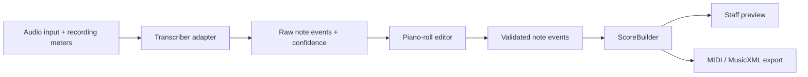

# Audio2Score

Audio2Score is an experimental iOS app for turning recorded or imported music
into editable note data and, eventually, readable sheet music.

> **Status:** Early prototype. The JSON contract, bundled C major chord WAV,
> demo FastAPI worker, iOS playback/import, and piano-roll preview work. Real
> audio transcription and export are not implemented yet. The worker still
> returns the hardcoded chord when a file is uploaded.

## Product direction

Audio2Score aims to produce **accurate transcription of one or more instruments** 
from audio files, MIDI files, or on-device live recording. If capturing multiple 
sources for notation proves difficult, the app will isolate a single instrument 
and build an editable notation file from that.

**Must be compatible with other notation software:** MIDI and MusicXML export 
are first-class features, not afterthoughts.

The publishable first version prioritizes **solo or isolated pitched instruments**, 
including polyphonic playing such as piano or guitar chords. All transcription 
runs on-device where practical, avoiding recurring server costs and keeping 
users' recordings private.

Full-song, multi-instrument transcription remains an important research track. 
The project will not promise publication-ready notation directly from arbitrary 
commercial recordings. Raw note detection and score construction are separate 
problems and will be built and evaluated separately.

## Competitive edge: accuracy you can trust and fix fast

Audio2Score's edge is **not** a bigger cloud model. It is **accuracy the user 
can trust and fix quickly, all on-device**.

### MVP accuracy strategy

1. **Constrain the problem.** Short clips, one clear instrument, guided 
   recording with real-time gain/noise/clipping meters so the transcription 
   engine receives clean input.

2. **Ensemble of small on-device models tuned per instrument** (piano, guitar, 
   strings) rather than one generic network. Basic Pitch remains the Phase 1 
   MVP candidate; adapter architecture supports swapping or blending models.

3. **Honest UI before quantization.** Show confidence scores, onset uncertainty, 
   and "possible octave/harmonic" flags directly on the piano roll *before* any 
   quantization or ScoreBuilder pass. Users see what the model actually detected, 
   not an over-confident guess.

4. **Tight edit loop.** Tap to split, merge, or nudge notes in the piano roll, 
   then lock confirmed notes → ScoreBuilder → staff. Fast iteration beats 
   perfect first-pass transcription.

5. **Fixture-backed evaluation in CI.** Every model change proves recall and 
   spurious-note rates on known chords and scales. No regression in accuracy 
   without explicit acknowledgment.

This strategy shifts the product's value from "magical one-click transcription" 
to "fast, inspectable, correctable workflow."

## Scope

### Publishable MVP

- Import or record a short solo or isolated instrument performance with guided 
  recording (gain/noise/clipping meters).
- Detect simultaneous notes, onsets, and durations using a small on-device 
  model (Basic Pitch as Phase 1 candidate).
- Display raw transcription results as an **honest, unquantized piano roll** 
  with confidence scores, onset uncertainty, and harmonic/octave flags visible.
- **Tight edit loop:** tap to split, merge, or nudge notes; lock confirmed 
  events.
- Convert validated note events into a simple staff preview via ScoreBuilder.
- Export MIDI and MusicXML for use in other notation software.
- **Fixture-backed CI evaluation** proving recall/spurious-note rates on known 
  test fixtures.

### Research track

- Transcribe realistic multi-instrument mixes.
- Evaluate instrument-conditioned transcription (MuScriptor).
- Ensemble or blend small per-instrument models.
- Keep experimental model code behind adapters so the app is not locked to one 
  engine.

### Not in the first release

- Importing or downloading from Apple Music, YouTube, or other streaming
  services.
- Guaranteed separation of arbitrary instruments from dense mixes.
- Unbounded cloud processing or permanent storage of uploaded recordings.

## Architecture



The transcription result represents what was heard, in seconds, with **confidence 
scores and onset uncertainty intact**. The piano-roll editor shows these 
confidence signals and lets users split, merge, or nudge notes before locking 
them. Only then does `ScoreBuilder` estimate beats and measures, quantize 
durations, assign voices, and create rests and ties.

This boundary prevents model output from being mistaken for finished notation 
and keeps the user in control of accuracy.

Model-specific dependencies and output mapping belong behind a small transcriber 
interface. Small per-instrument models can be loaded selectively. A plugin 
framework, model microservice, background job system, and source-separation 
stage will only be introduced when measurements show that they are necessary.

## Roadmap

### Phase 0 — Prototype baseline (complete)

- [x] Define and validate a transcription JSON schema.
- [x] Add FastAPI health and hardcoded demo-transcription endpoints.
- [x] Test the worker, fake engine, and schema contract.
- [x] Create the SwiftUI app and decode a bundled demo transcription.

### Phase 1 — Feasibility and engine decision (complete)

- [x] Create two legally usable 10–20 second fixtures: isolated polyphonic 
  instrument and small mixed arrangement with known notes.
- [x] Evaluate Basic Pitch on the isolated fixture.
- [x] Evaluate MuScriptor availability and licensing constraints for research 
  track.
- [x] Select Basic Pitch for publishable MVP; document decision in 
  `docs/phase1-engine-decision.md`.

**Outcome:** Basic Pitch meets all acceptance criteria for isolated/solo 
instruments. 100% recall, sub-second latency, Apache 2.0 license. MuScriptor 
remains research-track for multi-instrument evaluation.

### Phase 2 — Honest piano roll and tight edit loop

- [ ] Put Basic Pitch behind a `Transcriber` adapter.
- [ ] Process bundled fixture instead of returning hardcoded notes.
- [ ] Extend contract to capture confidence scores and onset uncertainty from 
  model output (do not invent data the model does not provide).
- [ ] Render pitch, onset, duration, overlap, **and confidence/uncertainty 
  flags** in an interactive piano roll.
- [ ] Implement tap-to-split, tap-to-merge, drag-to-nudge note editing.
- [ ] Add "lock notes" action that freezes validated events for ScoreBuilder.
- [ ] Cover success, loading, cancellation, and failure states with tests.
- [ ] Add fixture-backed evaluation to CI: prove recall and spurious-note rates 
  on `isolated-piano.wav` and one additional test fixture.

Acceptance criteria: user loads real audio, sees honest confidence visualization, 
edits notes, locks them, and the locked events match known ground truth within 
tolerance.

### Phase 3 — ScoreBuilder and export interop

- [ ] Estimate tempo and beat positions independently from locked note events 
  (not raw transcription).
- [ ] Quantize notes into measures while preserving simultaneous notes as chords.
- [ ] Generate rests, ties, clefs, and simple voice assignments.
- [ ] Render a deterministic staff preview for known rhythmic fixtures.
- [ ] Export MIDI and validate in at least one external DAW or notation app.
- [ ] Export MusicXML and validate correct import in MuseScore, Finale, or 
  Sibelius.
- [ ] Document export limitations and known edge cases.

Acceptance criteria: locked piano-roll events → staff notation → MIDI/MusicXML 
that opens correctly in external software.

### Phase 4 — Guided recording and user-file MVP

- [ ] Add live audio recording with real-time gain, noise floor, and clipping 
  meters.
- [ ] Guide users to produce clean input (visual feedback, recording tips).
- [ ] Add file selection with duration and size limits.
- [ ] Keep inference on-device (Basic Pitch TFLite model bundled in app).
- [ ] Add actionable errors, progress, cancellation, and accessibility labels.
- [ ] Document privacy behavior and require users to confirm they have rights 
  to process the selected audio.
- [ ] Test representative solo instruments (piano, guitar, flute, vocals) and 
  record known limitations before submission.
- [ ] App Store preparation: privacy policy, rejection risk mitigation, beta 
  testing plan.

### Phase 5+ — Research and hardening (future)

- [ ] Evaluate MuScriptor on multi-instrument fixtures (requires HuggingFace 
  auth and written permission for App Store use).
- [ ] Prototype per-instrument model selection or blending.
- [ ] Expand fixture library: guitar, strings, brass, edge cases.
- [ ] Optimize model size and inference latency for older devices.
- [ ] User testing with musicians; iterate on edit loop and guided recording UX.

## Model and licensing policy

| Engine | Intended use | Current policy |
| --- | --- | --- |
| Fake engine | Contract and UI development | Included now |
| [Basic Pitch](https://github.com/spotify/basic-pitch) | Solo or isolated polyphonic instruments | Candidate for the publishable, on-device MVP; Apache-2.0 |
| [MuScriptor](https://github.com/muscriptor/muscriptor) | Full mixes and instrument-conditioned research | Local evaluation only until public App Store use is confirmed in writing; code is MIT, weights are CC BY-NC 4.0 |

Audio2Score is currently a personal, budget-constrained project. There is no
licensing budget, and monetization is undecided. No paid feature, advertising,
tip mechanism, or public MuScriptor-powered service should be introduced until
the applicable model terms are confirmed.

## Release gates

A public App Store build requires all of the following:

- a model license compatible with the exact release and monetization plan;
- acceptable results on the project's fixture set;
- a clear statement that users may process only audio they are authorized to
  use;
- documented handling of recordings and generated results;
- sustainable inference costs, ideally zero marginal cost through on-device
  processing.

## Repository layout

```text
contracts/  Shared JSON schema and example transcription
fixtures/   Bundled C major chord WAV
ios/        SwiftUI application and iOS tests
worker/     FastAPI worker, engine adapters, and Python tests
TODO.md     Pointer to the active roadmap and immediate task
```

## Development

### Worker

Requirements: Python 3.13 and [uv](https://docs.astral.sh/uv/).

```bash
cd worker
uv sync
uv run uvicorn app.main:app --reload
```

Run the worker tests:

```bash
cd worker
uv run pytest -q
```

Run the complete repository verification on macOS with Xcode installed:

```bash
./scripts/verify
```

This checks the locked Python environment, worker tests, dependency advisories,
and static analysis, then compiles the iOS app and test bundles without code
signing. GitHub Actions runs the same command on `macos-26`. Running the iOS
tests still requires an installed simulator runtime or a configured
development profile.

## License

The application code and the synthesized `fixtures/c-major-chord.wav` are MIT.
See [LICENSE](LICENSE). Candidate transcription engines keep their own terms
under [Model and licensing policy](#model-and-licensing-policy). This is a
personal prototype; do not assume pull requests are reviewed.

The current endpoints are:

- `GET /health`
- `GET /v1/transcriptions/demo`
- `GET /v1/audio/demo`
- `POST /v1/transcriptions` (multipart file field `audio`; fake engine still
  returns the bundled C major chord)

### iOS app

Open the project in Xcode:

```bash
open ios/Audio2Score/Audio2Score.xcodeproj
```

The app loads `transcription.example.json` and `c-major-chord.wav` from its
bundle. It shows engine, key, tempo, note count, a piano roll of the C–E–G
chord, playback of the demo WAV, and import of a user audio file for playback
only.

## Open decisions

- Whether MuScriptor's authors permit use in a free, ad-free personal App Store
  release.
- Which engine meets the fixture-based quality threshold.
- Whether a backend is ever necessary for the public application.
- What monetization model, if any, is sustainable after users validate the MVP.
