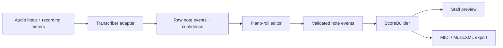

# openBard

openBard is an experimental iOS app. It turns recorded or imported music into
editable notes, then later into sheet music.

Early prototype. These pieces work: the JSON contract, the bundled C major
chord WAV, the demo FastAPI worker, iOS playback and import, and the piano-roll
preview. Live audio transcription and file export are not implemented. When a
file is uploaded, the worker still returns the hardcoded C major chord.

## Product direction

openBard should transcribe one or more instruments from an audio file, a MIDI
file, or an on-device live recording. If several sources are too hard to
notate, the app isolates one instrument and builds an editable notation file
from that.

The first release must export MIDI and MusicXML so the file opens in other
notation software.

The first App Store version targets solo or isolated pitched instruments,
including polyphonic playing such as piano or guitar chords. Transcription
runs on-device when the model fits. That avoids a per-request server bill.
Recordings stay on the phone.

Full-song, multi-instrument transcription is a research track. The project
will not claim publication-ready notation from arbitrary commercial recordings.
Detecting notes and building a score are separate problems. They are built and
tested separately.

## MVP accuracy plan

1. **Constrain the problem.** Short clips, one clear instrument, guided
   recording with real-time gain, noise, and clipping meters so the engine
   gets clean input.

2. **Small on-device models per instrument.** Piano, guitar, and strings get
   their own networks instead of one generic network. Basic Pitch is the
   Phase 1 MVP candidate. An adapter lets you swap or blend models.

3. **Show model output before quantization.** The piano roll shows confidence
   scores, onset uncertainty, and possible octave or harmonic flags before any
   ScoreBuilder pass. Users see what the model detected.

4. **Edit, then lock, then score.** Split, merge, or nudge notes on the piano
   roll. Lock the ones you confirm. ScoreBuilder then builds the staff.

5. **Fixture checks in CI.** Each model change must report recall and
   spurious-note rates on known chords and scales. An accuracy drop needs an
   explicit note in the change.

## Scope

### Publishable MVP

- Import or record a short solo or isolated instrument performance with guided
  recording (gain, noise, and clipping meters).
- Detect simultaneous notes, onsets, and durations with a small on-device
  model (Basic Pitch as the Phase 1 candidate).
- Show raw transcription on an unquantized piano roll, including confidence,
  onset uncertainty, and harmonic or octave flags.
- Split, merge, or nudge notes. Lock confirmed events.
- Convert locked note events into a staff preview with ScoreBuilder.
- Export MIDI and MusicXML for other notation software.
- CI checks recall and spurious-note rates on known fixtures.

### Research track

- Transcribe realistic multi-instrument mixes.
- Evaluate instrument-conditioned transcription (MuScriptor).
- Blend small per-instrument models.
- Keep experimental model code behind adapters so the app is not locked to one
  engine.

### Not in the first release

- Importing or downloading from Apple Music, YouTube, or other streaming
  services.
- Guaranteed separation of arbitrary instruments from dense mixes.
- Unbounded cloud processing or permanent storage of uploaded recordings.

## Architecture



The transcription JSON stores what was heard, in seconds, including confidence
and onset uncertainty. The piano-roll editor shows those fields and lets users
split, merge, or nudge notes before locking them. After lock, `ScoreBuilder`
estimates beats and measures, quantizes durations, assigns voices, and creates
rests and ties.

ScoreBuilder runs only on locked notes. The staff is not the raw model output.

Model-specific dependencies and output mapping live behind a small transcriber
interface. Per-instrument models can load one at a time. Do not add a plugin
framework, model microservice, background job system, or source-separation
stage until measurements show you need them.

## Roadmap

### Phase 0. Prototype baseline (complete)

- [x] Define and validate a transcription JSON schema.
- [x] Add FastAPI health and hardcoded demo-transcription endpoints.
- [x] Test the worker, fake engine, and schema contract.
- [x] Create the SwiftUI app and decode a bundled demo transcription.

### Phase 1. Feasibility and engine decision (complete)

- [x] Create two legally usable 10 to 20 second fixtures: isolated polyphonic
  instrument and small mixed arrangement with known notes.
- [x] Evaluate Basic Pitch on the isolated fixture.
- [x] Evaluate MuScriptor availability and licensing constraints for research
  track.
- [x] Select Basic Pitch for publishable MVP; document decision in
  `docs/phase1-engine-decision.md`.

**Outcome.** Basic Pitch meets the isolated and solo instrument criteria.
100% recall, sub-second latency, Apache 2.0 license. MuScriptor stays on the
research track for multi-instrument evaluation.

### Phase 2. Piano roll and edit loop

iOS edit loop and fixture JSON are in (see `TODO.md`). Worker
`POST /v1/transcriptions` still returns the hardcoded chord.

- [ ] Put Basic Pitch behind a `Transcriber` adapter.
- [ ] Process bundled fixture instead of returning hardcoded notes.
- [ ] Extend contract to capture confidence scores and onset uncertainty from
  model output (do not invent data the model does not provide).
- [ ] Render pitch, onset, duration, overlap, and confidence or uncertainty
  flags in an interactive piano roll.
- [ ] Implement tap-to-split, tap-to-merge, drag-to-nudge note editing.
- [ ] Add a lock-notes action that freezes validated events for ScoreBuilder.
- [ ] Cover success, loading, cancellation, and failure states with tests.
- [ ] Add fixture-backed evaluation to CI: prove recall and spurious-note rates
  on `isolated-piano.wav` and one additional test fixture.

Acceptance criteria: the user loads real audio, sees confidence on the piano
roll, edits notes, locks them, and the locked events match known ground truth
within tolerance.

### Phase 3. ScoreBuilder and export

- [x] Estimate tempo and beat positions independently from locked note events
  (not raw transcription).
- [x] Quantize notes into measures while preserving simultaneous notes as chords.
- [x] Generate rests, ties, clefs, and simple voice assignments.
- [x] Render a deterministic staff preview for known rhythmic fixtures.
- [ ] Export MIDI and validate in at least one external DAW or notation app.
- [ ] Export MusicXML and validate correct import in MuseScore, Finale, or
  Sibelius.
- [ ] Document export limitations and known edge cases.

Acceptance criteria: locked piano-roll events become staff notation, then MIDI
or MusicXML that opens correctly in external software.

### Phase 4. Guided recording and user-file MVP

- [ ] Add live audio recording with real-time gain, noise floor, and clipping
  meters.
- [ ] Guide users to produce clean input (visual feedback, recording tips).
- [ ] Add file selection with duration and size limits.
- [ ] Keep inference on-device (Basic Pitch TFLite model bundled in app).
- [ ] Add errors that say what to do, plus progress, cancellation, and
  accessibility labels.
- [ ] Document privacy behavior and require users to confirm they have rights
  to process the selected audio.
- [ ] Test representative solo instruments (piano, guitar, flute, vocals) and
  record known limitations before submission.
- [ ] App Store preparation: privacy policy, rejection-risk plan, beta
  testing plan.

### Phase 5+. Research and hardening

- [ ] Evaluate MuScriptor on multi-instrument fixtures (requires HuggingFace
  auth and written permission for App Store use).
- [ ] Prototype per-instrument model selection or blending.
- [ ] Expand fixture library: guitar, strings, brass, edge cases.
- [ ] Optimize model size and inference latency for older devices.
- [ ] User testing with musicians. Iterate on the edit loop and guided
  recording UI.

## Model and licensing policy

| Engine | Intended use | Current policy |
| --- | --- | --- |
| Fake engine | Contract and UI development | Included now |
| [Basic Pitch](https://github.com/spotify/basic-pitch) | Solo or isolated polyphonic instruments | Candidate for the publishable, on-device MVP; Apache-2.0 |
| [MuScriptor](https://github.com/muscriptor/muscriptor) | Full mixes and instrument-conditioned research | Local evaluation only until public App Store use is confirmed in writing; code is MIT, weights are CC BY-NC 4.0 |

openBard is a personal project with no licensing budget. Monetization is
undecided. Do not add a paid feature, ads, tips, or a public MuScriptor-powered
service until the model terms for that use are confirmed.

## Release gates

A public App Store build requires all of the following:

- a model license compatible with the exact release and monetization plan
- acceptable results on the project's fixture set
- a clear statement that users may process only audio they are authorized to
  use
- documented handling of recordings and generated results
- inference that does not require a per-request cloud bill, preferably by
  running on-device

## Repository layout

```text
contracts/  Shared JSON schema and example transcription
fixtures/   Bundled C major chord WAV
ios/        SwiftUI application and iOS tests
worker/     FastAPI worker, engine adapters, and Python tests
TODO.md     Pointer to the active roadmap and immediate task
```

## Development

### Worker

Requirements: Python 3.11 and [uv](https://docs.astral.sh/uv/).
`worker/pyproject.toml` sets `requires-python = ">=3.11,<3.13"` because of
Basic Pitch and TensorFlow. GitHub Actions installs 3.11.

```bash
cd worker
uv sync
uv run uvicorn app.main:app --reload
```

Current endpoints:

- `GET /health`
- `GET /v1/transcriptions/demo`
- `GET /v1/audio/demo`
- `POST /v1/transcriptions` (multipart file field `audio`; fake engine still
  returns the bundled C major chord)

Worker tests:

```bash
cd worker
uv run pytest -q
```

Full repo check on macOS with Xcode installed:

```bash
./scripts/verify
```

That command checks the locked Python environment, worker tests, dependency
advisories, and static analysis, then compiles the iOS app and test bundles
without code signing. GitHub Actions runs the same command on `macos-26`.
Running the iOS tests still needs an installed simulator runtime or a
configured development profile.

### iOS app

Open the project in Xcode:

```bash
open ios/OpenBard/OpenBard.xcodeproj
```

The app loads `transcription.example.json` and `c-major-chord.wav` from its
bundle. It shows a compact summary (`dsp_v0 · C major · 120 BPM · 3 notes`),
a pinch-zoom piano roll of the C-E-G chord, an empty Score viewport until notes
are locked, playback of the demo WAV, and import of a user audio file for
playback only. The app does not call the worker.

## License

The application code and the synthesized `fixtures/c-major-chord.wav` are MIT.
See [LICENSE](LICENSE). Candidate transcription engines keep their own terms
under [Model and licensing policy](#model-and-licensing-policy). This is a
personal prototype. Do not assume pull requests are reviewed.

## Open decisions

- Whether MuScriptor's authors permit use in a free, ad-free personal App Store
  release.
- Which engine meets the fixture-based quality threshold.
- Whether a backend is ever necessary for the public application.
- What monetization model, if any, can fund the app after users validate the
  MVP.
