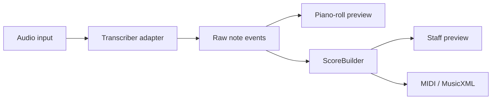

# Audio2Score

Audio2Score is an experimental iOS app for turning recorded or imported music
into editable note data and, eventually, readable sheet music.

> **Status:** Early prototype. The JSON contract, bundled C major chord WAV,
> demo FastAPI worker, iOS playback/import, and piano-roll preview work. Real
> audio transcription and export are not implemented yet. The worker still
> returns the hardcoded chord when a file is uploaded.

## Product direction

The publishable first version will prioritize **solo or isolated pitched
instruments**, including polyphonic playing such as piano or guitar chords. It
should run transcription on the device where practical, avoiding recurring
server costs and keeping users' recordings private.

Full-song, multi-instrument transcription remains an important research track.
The first experiment will evaluate whether a user can:

- transcribe all detected instruments;
- focus on a known instrument;
- derive a monophonic main, top, or bass line from the selected part.

The project will not promise publication-ready notation directly from arbitrary
commercial recordings. Raw note detection and score construction are separate
problems and will be built and evaluated separately.

## Scope

### Publishable MVP

- Import or record a short solo or isolated instrument performance.
- Detect simultaneous notes, onsets, and durations.
- Display the result first as an honest, unquantized piano roll.
- Convert validated results into a simple staff preview.
- Export MIDI; add MusicXML when score construction is reliable.

### Research track

- Transcribe realistic multi-instrument mixes.
- Preserve instrument labels when the engine supplies them reliably.
- Compare full transcription with instrument-conditioned transcription.
- Keep experimental model code behind an adapter so it cannot lock the app to
  one engine.

### Not in the first release

- Importing or downloading from Apple Music, YouTube, or other streaming
  services.
- Guaranteed separation of arbitrary instruments from dense mixes.
- Unbounded cloud processing or permanent storage of uploaded recordings.

## Architecture



The transcription result represents what was heard in seconds. `ScoreBuilder`
will later estimate beats and measures, quantize durations, assign voices, and
create rests and ties. This boundary prevents model output from being mistaken
for finished notation.

Model-specific dependencies and output mapping belong behind a small
transcriber interface. A plugin framework, model microservice, background job
system, and source-separation stage will only be introduced when measurements
show that they are necessary.

## Roadmap

### Phase 0 — Prototype baseline (complete)

- [x] Define and validate a transcription JSON schema.
- [x] Add FastAPI health and hardcoded demo-transcription endpoints.
- [x] Test the worker, fake engine, and schema contract.
- [x] Create the SwiftUI app and decode a bundled demo transcription.

### Phase 1 — Feasibility and engine decision (next, 2–3 days)

- [ ] Send MuScriptor's authors a written request covering a free, ad-free
  personal App Store release and possible future monetization. Author response
  time is outside the estimate.
- [ ] Create two legally usable 10–20 second fixtures: one isolated polyphonic
  instrument and one small mixed arrangement with known notes.
- [ ] Evaluate Basic Pitch on the isolated fixture.
- [ ] Evaluate MuScriptor locally on the mixed fixture, both unconditioned and
  conditioned on a known instrument; record accuracy, latency, peak memory,
  model size, and manual correction effort.
- [ ] Select a publishable engine and record the decision. "Solo/isolated only"
  is a valid outcome.

Acceptance criteria:

- The isolated fixture recovers every expected chord pitch within 100 ms of its
  onset, without a long spurious note.
- Focused output materially reduces unwanted notes compared with the full mix.
- No adapter invents unavailable tempo, key, velocity, or confidence values.
- Runtime and licensing are acceptable for the intended release path.

### Phase 2 — First real vertical slice (3–5 days)

- [ ] Put the selected engine behind a `Transcriber` adapter.
- [ ] Process one bundled audio fixture instead of returning hardcoded notes.
- [ ] Make only the contract changes justified by observed model output.
- [ ] Render pitch, onset, duration, and overlap in a piano roll.
- [ ] Cover success, loading, cancellation, and failure states with tests.

Acceptance criteria: one action processes real audio and produces a visual
result whose notes can be compared with the known fixture.

### Phase 3 — Score construction (1–2 weeks)

- [ ] Estimate tempo and beat positions independently from note transcription.
- [ ] Quantize notes into measures while preserving simultaneous notes as
  chords.
- [ ] Generate rests, ties, clefs, and simple voice assignments.
- [ ] Render a deterministic staff preview for known rhythmic fixtures.
- [ ] Export MIDI and validate MusicXML in at least one notation application.

### Phase 4 — User-file MVP and App Store preparation (1–2 weeks)

- [ ] Add audio recording and file selection with duration and size limits.
- [ ] Keep publishable MVP inference on-device unless a sustainable backend is
  justified.
- [ ] Add actionable errors, progress, cancellation, and accessibility labels.
- [ ] Document privacy behavior and require users to confirm they have rights
  to process the selected audio.
- [ ] Test representative instruments and record known limitations before
  submission.

## Model and licensing policy

| Engine | Intended use | Current policy |
| --- | --- | --- |
| Fake engine | Contract and UI development | Included now |
| [Basic Pitch](https://github.com/spotify/basic-pitch) | Solo or isolated polyphonic instruments | Candidate for the publishable, on-device MVP; Apache-2.0 |
| [MuScriptor](https://github.com/muscriptor/muscriptor) | Full mixes and instrument-conditioned research | Local evaluation only until public App Store use is confirmed in writing; code is MIT, weights are CC BY-NC 4.0 |

Audio2Score is currently a personal, budget-constrained project. There is no
licensing budget, and monetization is undecided. No paid feature, advertising,
tip mechanism, or public MuScriptor-powered service should be introduced until
the applicable model terms are confirmed.

## Release gates

A public App Store build requires all of the following:

- a model license compatible with the exact release and monetization plan;
- acceptable results on the project's fixture set;
- a clear statement that users may process only audio they are authorized to
  use;
- documented handling of recordings and generated results;
- sustainable inference costs, ideally zero marginal cost through on-device
  processing.

## Repository layout

```text
contracts/  Shared JSON schema and example transcription
fixtures/   Bundled C major chord WAV
ios/        SwiftUI application and iOS tests
worker/     FastAPI worker, engine adapters, and Python tests
TODO.md     Pointer to the active roadmap and immediate task
```

## Development

### Worker

Requirements: Python 3.13 and [uv](https://docs.astral.sh/uv/).

```bash
cd worker
uv sync
uv run uvicorn app.main:app --reload
```

Run the worker tests:

```bash
cd worker
uv run pytest -q
```

Run the complete repository verification on macOS with Xcode installed:

```bash
./scripts/verify
```

This checks the locked Python environment, worker tests, dependency advisories,
and static analysis, then compiles the iOS app and test bundles without code
signing. GitHub Actions runs the same command on `macos-26`. Running the iOS
tests still requires an installed simulator runtime or a configured
development profile.

## License

The application code and the synthesized `fixtures/c-major-chord.wav` are MIT.
See [LICENSE](LICENSE). Candidate transcription engines keep their own terms
under [Model and licensing policy](#model-and-licensing-policy). This is a
personal prototype; do not assume pull requests are reviewed.

The current endpoints are:

- `GET /health`
- `GET /v1/transcriptions/demo`
- `GET /v1/audio/demo`
- `POST /v1/transcriptions` (multipart file field `audio`; fake engine still
  returns the bundled C major chord)

### iOS app

Open the project in Xcode:

```bash
open ios/Audio2Score/Audio2Score.xcodeproj
```

The app loads `transcription.example.json` and `c-major-chord.wav` from its
bundle. It shows engine, key, tempo, note count, a piano roll of the C–E–G
chord, playback of the demo WAV, and import of a user audio file for playback
only.

## Open decisions

- Whether MuScriptor's authors permit use in a free, ad-free personal App Store
  release.
- Which engine meets the fixture-based quality threshold.
- Whether a backend is ever necessary for the public application.
- What monetization model, if any, is sustainable after users validate the MVP.
