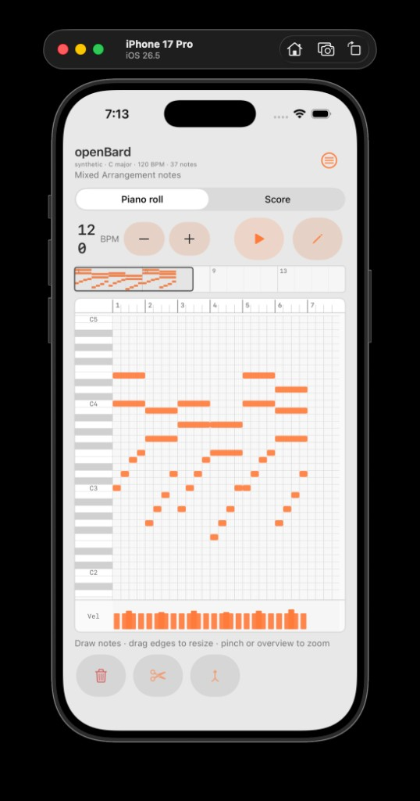
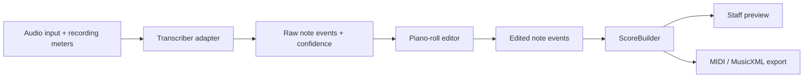

# openBard

openBard is an experimental iOS app. It turns recorded or imported music into
editable notes, then later into sheet music.



**Shipped today:** JSON contract, FastAPI worker with live Basic Pitch on
upload, blank-first Ableton-style piano roll (Draw, BPM, overview zoom,
synth Play), ScoreBuilder staff from all notes, MIDI and MusicXML export.
**Not shipped:** on-device inference, guided recording, app→worker wiring.
The iOS app edits notes locally; it does not call the worker.

## Status

**Updated:** 2026-09-11

### Next

1. Phase 4: guided recording + on-device Basic Pitch (app still does not call the worker).
2. Edit polish: multi-select, undo/redo, velocity-lane pin editing, richer overview chrome.
3. Validate MusicXML in MuseScore; document rhythm/key export limits.

### Shipped

#### Phase 0 — Prototype baseline
- Transcription JSON schema + example (`contracts/`)
- FastAPI worker: `GET /health`, `GET /v1/transcriptions/demo`, `GET /v1/audio/demo`
- Fake engine for demo/contract tests
- SwiftUI app + WAV import-for-playback (reference listen only)

#### Phase 1 — Engine decision
- Fixtures: `isolated-piano.wav`, `mixed-arrangement.wav` + ground truth
- **Basic Pitch** chosen for publishable MVP (solo/isolated polyphonic)
- Eval on isolated piano: 100% recall, 0 long spurious notes, ~0.5s latency, Apache-2.0
- MuScriptor: research only (gated HF weights, CC BY-NC 4.0) — not for App Store without written permission
- Artifacts: `fixtures/basic-pitch-eval-results.json`, `scripts/eval_*.py`, `scripts/check_basicpitch_eval.py` in CI

#### Phase 2 / 2b — Piano roll and edit loop
- `Transcriber` adapter; **`BasicPitchTranscriber`** on `POST /v1/transcriptions` (live inference)
- Demo GET still fake `dsp_v0`; amplitude mapped to velocity + confidence (no invented 1.0)
- Contract: optional tempo/key, `onset_uncertainty_seconds`, `basic_pitch` engine enum
- **Blank-first launch** (`manual` engine, Draw on); Library fixtures optional; New blank resets the roll
- Ableton-inspired chrome: keyboard gutter, beat grid, velocity lane, transport (BPM default **120**, Play/Stop, Draw)
- **Clip overview hotspot** — drag/resize visible time window; pinch also zooms time
- Stable pitch viewport (no reflow under finger); drag move; **L/R edge resize**
- Split / merge / delete; Play **synthesizes** current note events (not fixture WAV)
- Worker + iOS unit tests; fixture-backed Basic Pitch recall check in `./scripts/verify`

#### Phase 3 — Score + export
- `ScoreBuilder` from **all notes** (no lock gate); uses transport BPM when set
- Staff preview on Score workspace as soon as the roll has notes
- **MIDI export** (Format 0 SMF) via Score workspace ShareLink
- **MusicXML export** (partwise 3.1) via Score workspace ShareLink
  - Limits: C major key only, no dotted rhythm encoding, rests typed but simple; validate in MuseScore

### Not shipped

| Area | Gap |
| --- | --- |
| Export | MuseScore validation notes; richer rhythm/key encoding |
| iOS ↔ engine | App does **not** call the worker; no on-device Basic Pitch yet |
| Import | User audio is reference playback only; does not re-transcribe onto the roll |
| Recording | No live capture, meters, or guided UX |
| Edit polish | Undo/redo, multi-select, velocity pins, persist edited JSON |
| Research | MuScriptor multi-instrument; per-instrument models; larger fixture set |

### Honest limitations

- Worker live path needs a Basic Pitch backend (CoreML on macOS; TF/TFLite/ONNX elsewhere). `setuptools` pinned `<81` for `resampy` (CI ignores PYSEC-2026-3447).
- Basic Pitch has no tempo/key; those fields stay null on live POST. App tempo is user-editable (default 120).
- Precision on isolated piano was ~57% (extra harmonics/phantoms); users edit the roll before trusting Score/export.
- Staff preview is deterministic for known patterns, not publication-ready engraving.
- Note playback is a simple sine preview, not a sampled instrument.

## Product direction

openBard should transcribe one or more instruments from an audio file, a MIDI
file, or an on-device live recording. If several sources are too hard to
notate, the app isolates one instrument and builds an editable notation file
from that.

The first release must export MIDI and MusicXML so the file opens in other
notation software.

The first App Store version targets solo or isolated pitched instruments,
including polyphonic playing such as piano or guitar chords. Transcription
runs on-device when the model fits. That avoids a per-request server bill.
Recordings stay on the phone.

Full-song, multi-instrument transcription is a research track. The project
will not claim publication-ready notation from arbitrary commercial recordings.
Detecting notes and building a score are separate problems. They are built and
tested separately.

## MVP accuracy plan

1. **Constrain the problem.** Short clips, one clear instrument, guided
   recording with real-time gain, noise, and clipping meters so the engine
   gets clean input.

2. **Small on-device models per instrument.** Piano, guitar, and strings get
   their own networks instead of one generic network. Basic Pitch is the MVP
   candidate. An adapter lets you swap or blend models.

3. **Show model output before quantization.** The piano roll shows confidence
   scores, onset uncertainty, and possible octave or harmonic flags before any
   ScoreBuilder pass. Users see what the model detected.

4. **Edit, then score.** Start on a blank roll, Draw notes, Play a synth
   preview, reshape timing on a stable viewport (overview / pinch zoom), then
   open Score. Fixtures remain optional in Library. No lock step.

5. **Fixture checks in CI.** Each model change must report recall and
   spurious-note rates on known chords and scales. An accuracy drop needs an
   explicit note in the change.

## Scope

### Publishable MVP

- Import or record a short solo or isolated instrument performance with guided
  recording (gain, noise, and clipping meters).
- Detect simultaneous notes, onsets, and durations with a small on-device
  model (Basic Pitch).
- Show raw transcription on an unquantized piano roll, including confidence,
  onset uncertainty, and harmonic or octave flags.
- Draw, split, merge, drag, and resize notes; synth-preview playback.
- Convert note events into a staff preview with ScoreBuilder.
- Export MIDI and MusicXML for other notation software.
- CI checks recall and spurious-note rates on known fixtures.

### Research track

- Transcribe realistic multi-instrument mixes.
- Evaluate instrument-conditioned transcription (MuScriptor).
- Blend small per-instrument models.
- Keep experimental model code behind adapters so the app is not locked to one
  engine.

### Not in the first release

- Importing or downloading from Apple Music, YouTube, or other streaming
  services.
- Guaranteed separation of arbitrary instruments from dense mixes.
- Unbounded cloud processing or permanent storage of uploaded recordings.

## Architecture



The transcription JSON stores what was heard, in seconds, including confidence
and onset uncertainty. The piano-roll editor shows those fields and lets users
draw, split, merge, drag, and resize notes. `ScoreBuilder` takes the current
note list, estimates or uses transport BPM, quantizes durations, and creates
rests and ties for the staff preview and exports.

Staff preview is quantized notation, not the raw model output.

Model-specific dependencies and output mapping live behind a small transcriber
interface. Per-instrument models can load one at a time. Do not add a plugin
framework, model microservice, background job system, or source-separation
stage until measurements show you need them.

## Model and licensing policy

| Engine | Intended use | Current policy |
| --- | --- | --- |
| Fake engine | Contract and UI development | Included now (`GET /v1/transcriptions/demo`) |
| [Basic Pitch](https://github.com/spotify/basic-pitch) | Solo or isolated polyphonic instruments | MVP candidate; live on worker `POST /v1/transcriptions`; Apache-2.0 |
| [MuScriptor](https://github.com/muscriptor/muscriptor) | Full mixes and instrument-conditioned research | Local evaluation only until public App Store use is confirmed in writing; code is MIT, weights are CC BY-NC 4.0 |

openBard is a personal project with no licensing budget. Monetization is
undecided. Do not add a paid feature, ads, tips, or a public MuScriptor-powered
service until the model terms for that use are confirmed.

## Release gates

A public App Store build requires all of the following:

- a model license compatible with the exact release and monetization plan
- acceptable results on the project's fixture set
- a clear statement that users may process only audio they are authorized to
  use
- documented handling of recordings and generated results
- inference that does not require a per-request cloud bill, preferably by
  running on-device

## Repository layout

```text
README.md   Product direction + status (shipped / next / gaps)
docs/       Screenshots and other docs assets
contracts/  Shared JSON schema and example transcription
fixtures/   Audio fixtures, ground truth, eval results
ios/        SwiftUI application and iOS tests
worker/     FastAPI worker, engine adapters, and Python tests
scripts/    verify, fixture generation, engine eval
```

## Development

### Worker

Requirements: Python 3.11 and [uv](https://docs.astral.sh/uv/).
`worker/pyproject.toml` sets `requires-python = ">=3.11,<3.13"` because of
Basic Pitch. GitHub Actions installs 3.11.

```bash
cd worker
uv sync
uv run uvicorn app.main:app --reload
```

Endpoints:

- `GET /health`
- `GET /v1/transcriptions/demo` (fake `dsp_v0` C major chord)
- `GET /v1/audio/demo`
- `POST /v1/transcriptions` (multipart field `audio`; live Basic Pitch)

```bash
# from repo root, with worker running
curl -F "audio=@fixtures/c-major-chord.wav" http://127.0.0.1:8000/v1/transcriptions
# expect engine basic_pitch, pitches 60/64/67
```

Worker tests: `cd worker && uv run pytest -q`

Full repo check on macOS with Xcode:

```bash
./scripts/verify
```

That command checks the locked Python environment, worker tests, dependency
advisories, and static analysis, then compiles the iOS app and test bundles
without code signing. GitHub Actions runs the same command on `macos-26`.

### iOS app

```bash
open ios/OpenBard/OpenBard.xcodeproj
```

Launch is a **blank** piano roll with Draw on and BPM 120. Draw notes, resize
edges, pinch or use the clip overview to zoom time, Play for a sine synth
preview, then switch to Score for staff + MIDI/MusicXML export. Library can
load fixtures or import audio for reference playback. The app does not call
the worker.

Quick path: blank roll → Draw notes → Play synth → Score staff → export.

## License

The application code and the synthesized `fixtures/c-major-chord.wav` are MIT.
See [LICENSE](LICENSE). Candidate transcription engines keep their own terms
under [Model and licensing policy](#model-and-licensing-policy). This is a
personal prototype. Do not assume pull requests are reviewed.

## Open decisions

- Whether MuScriptor's authors permit use in a free, ad-free personal App Store
  release.
- Whether a backend is ever necessary for the public application.
- What monetization model, if any, can fund the app after users validate the
  MVP.
